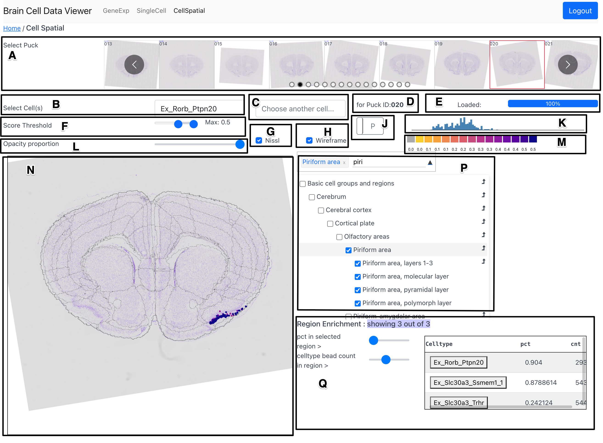

# Cell Spatial Tab

The CellSpatial tab shows a likelihood score of a celltype selected by the user
across the surface of a cross-section of the mouse brain. The user can also
select cross-sections from different available brain regions. The following
figure shows a snapshop of the CellSpatial tab, which is followed by a
description of the various components and associated functionality.

<figure>

<figcaption>Fig 1: A snapshot of the CellSpatial tab</figcaption>
</figure>

## Components

### Puck Selection Carousel (A)

The Puck Selection Carousel allows the user to select a puck (cross-section
location) from 101 availble pucks. The user can use the bubbles to jump
directly to a region of interest along the saggital axis.

### Primary Cell Selection (B)

The primary cell 

### Secondary Cell Selection (C)

### Puck ID Indicator (D)

### Progress Bar (E)

### UMI Count Threshold (F)

### Nissl Selection Checkbox (G)

### Wireframe Selection Checkbox (H)

### Histogram Selector (J)

### Global Histogram (K)

### Opacity Proportion (L)

### Adaptive Colorbar (M)

### Overlay Plot (N)

Puckwise or regionwise

### Region Selector and Dendrogram (P)

### Region Enrichment (Q)

