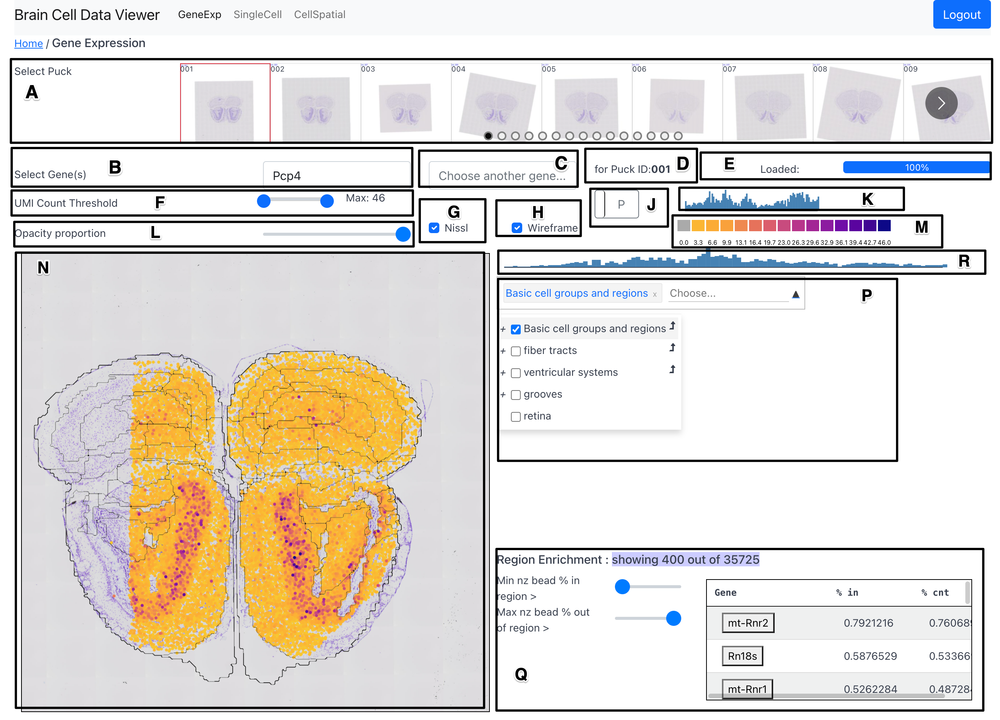

# Gene Expression Tab

The GeneExpr tab shows the expression of a gene selected by the user across the
surface of a cross-section of the mouse brain. The user can also select
cross-sections from different available brain regions. The following figure
shows a snapshop of the GeneExpr tab, which is followed by a description of the
various components and associated functionality.

<figure>

<figcaption>Fig 1: A snapshot of the GeneExp tab</figcaption>
</figure>

## Components

### Puck Selection Carousel (A)

The Puck Selection Carousel allows the user to select a puck (cross-section
location) from 101 availble pucks. The user can use the bubbles to jump
directly to a region of interest along the saggital axis.

### Primary Gene Selection (B)

The primary gene selection dropdown allows the user to select a gene to plot
its expression across area of the selected puck on the overlay plot (see N).

### Secondary Gene Selection (C)

The secondary gene selection dropdown allows the user to select a gene to view
its differential expression with regard to the gene selected in the primary
gene selection component (B). When a gene is selected in this component, a 2D
dimensional colormap is displayed in place of the initial adaptive colormap.
The vertical axis of the 2D colormap conveys expression of the primary gene
while its horizontal axis conveys the expression of the secondary gene. A
sample with high expression of both genes would show up in the color from the
top right region of the 2d colormap.

### Puck ID Indicator (D)

### Progress Bar (E)

### UMI Count Threshold (F)

### Nissl Selection Checkbox (G)

### Wireframe Selection Checkbox (H)

### Histogram Selector (J)

### Global Histogram (K)

### Opacity Proportion (L)

### Adaptive Colorbar (M)

### Overlay Plot (N)

Puckwise or regionwise

### Region Selector and Dendrogram (P)

### Region Enrichment (Q)

### Region Histogram (R)

